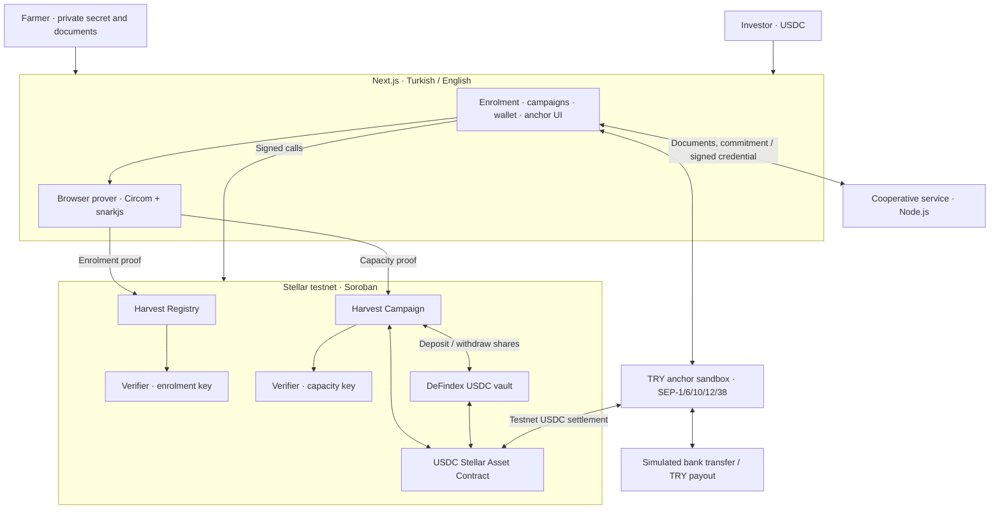

<picture>
  <source media="(prefers-color-scheme: dark)" srcset="packages/frontend/public/logo-dark.png">
  
</picture>

# Harvest

**Finance the next harvest. Keep the real numbers private.** A farmer needs
capital before the crop is ready, but proving their ability to deliver can mean
revealing the exact production figures a buyer can use in negotiations. Harvest
lets a farmer prove a simpler statement: an accredited cooperative has signed
off on an expected harvest above a stated threshold. The market sees that
threshold; the exact yield, parcel and supporting credential stay out of the
on-chain proof payload.

Investors fund the campaign in USDC on Stellar. Contributions enter a DeFindex
vault while funding is open. Once the campaign reaches its minimum, the farmer
can draw the advance, repay the agreed amount, and let investors claim their
share. A TRY anchor sandbox connects the demo to a local-currency deposit and
withdrawal flow.

The first application is cooperative-backed agriculture in Türkiye. The
capacity proof is reusable across crops and regions; the current membership
checks and fiat rail are specific to the Turkish demo. International campaigns
in the repository are testnet demonstrations, not evidence of overseas partners.

Hackathon MVP · Stellar testnet · Groth16 / BN254 · Soroban · DeFindex

**Repository:** [ytcsec/Harvest](https://github.com/ytcsec/Harvest) ·
**Campaign contract:** [CD6CVVLD…YZHXP](https://stellar.expert/explorer/testnet/contract/CD6CVVLDQGQ5OVQWPKTHVLNHFIPKXCFJGGLRMADOXQ7YGXED7RTYZHXP) ·
**Deployment manifest:** [deployments.json](deployments.json)

---

## Evaluating this in five minutes

With the [initial setup](#running-it-yourself) completed:

```bash
npm run circuit:test                    # 11 capacity + 19 enrolment checks
npm run contracts:test                  # 28 Rust tests in the source tree
npm run issuer                         # terminal 1: http://localhost:8787
npm run frontend                       # terminal 2: http://localhost:3000
```

The first install includes circuit compilation and testnet deployment, so allow
more than five minutes for that. A plain clone does not contain the private
issuer key or Groth16 proving keys needed for a working farmer flow.

What to look for, in order:

| | Where | What it shows |
|---|---|---|
| 1 | `/kayit` → cooperative review → proof → registration | Document eligibility is recorded as a bitmask without publishing the identity reference, parcel or land area |
| 2 | `/create` → capacity proof | The browser proves the threshold locally and checks the proof through a Soroban simulation |
| 3 | `npm run verify` | A valid capacity claim is accepted; a modified claim and replay from another account are refused in testnet simulations |
| 4 | `node scripts/lifecycle-on-testnet.mjs` | Actual testnet transactions: create → fund → vault withdrawal → repay → claim, with balance assertions |
| 5 | `/explore` and `/kampanya/<id>` | Campaign state, contributions and available actions read from the configured contracts |

The lifecycle script is the shortest contract-and-money demonstration. It signs
its own test attestation with the local issuer key; the browser flow exercises
the cooperative application separately. Transaction links are printed by the
scripts. Read [Honest limitations](#honest-limitations) alongside the demo.

---

## The problem

Farming has a timing gap: inputs, labour and equipment must be paid for before
the harvest can be sold. A producer seeking an advance needs to establish that
they can deliver, while protecting information about their business.

Exact expected yield and parcel size can reveal how much supply a farmer will
bring to market. Sharing those figures with every prospective funder expands
the audience for commercially sensitive data. Yet a claim with no independent
evidence gives investors little reason to commit.

Harvest addresses three parts of that problem:

1. **Evidence without full disclosure.** A signed capacity threshold can be
   verified without publishing the underlying production record.
2. **Capital before the full target is reached.** A campaign can specify a
   minimum viable raise and allow further drawdowns as contributions arrive.
3. **An explicit settlement path.** Funding, drawdowns, repayment and investor
   claims follow contract rules, with escrow held as vault shares.

The protocol verifies what an accredited issuer signed. It cannot establish
that a field was measured correctly or that a future harvest will happen.

## What Harvest does

**A cooperative checks membership before issuing a capacity attestation.** The
demo service reviews ÇKS farmer registration, a title deed or lease reference,
and optional TARSİM insurance information. It binds a membership to a commitment
to the farmer's secret. Subsequent attestation requests must present that
membership's commitment.

**The farmer proves eligibility without publishing the paperwork.** A separate
enrolment circuit checks the cooperative signature and derives the land
eligibility bit from the privately signed area. The current floor is **10
decares**, or one hectare. The registry requires mask **11**:

| Bit value | Meaning | Required by the configured registry |
|---|---|---|
| `1` | ÇKS registration checked | Yes |
| `2` | Title deed or lease checked | Yes |
| `4` | TARSİM insurance checked | No |
| `8` | Private land area meets the circuit's minimum | Yes |

**The market learns a lower bound on capacity.** For example, the test fixture
contains an expected harvest of 48,500 kg but proves only **at least 40,000 kg**.
The circuit checks the cooperative's EdDSA-Poseidon signature and the comparison;
the Soroban verifier checks the Groth16 proof, issuer accreditation and caller
binding. Increasing the public threshold after proving invalidates the proof.

**The same capacity nullifier cannot fund a second campaign.** The capacity
nullifier is `Poseidon(farmerSecret, season)`. The campaign contract records it
when a campaign is created and refuses reuse. If a campaign misses its minimum
and closes for refunds, the nullifier is released so the farmer can try again.
This is a per-secret, per-season invariant; real-person uniqueness also depends
on the cooperative's issuance policy.

**Funding can be partial.** `min_bps` sets the minimum as a share of the target.
At `5,000`, the farmer can draw once 50% has been raised and draw again as more
arrives. At `10,000`, the campaign is all-or-nothing. Contributions cannot exceed
the target or arrive after the deadline.

**Escrow is a vault position.** Each contribution deposits USDC into the
configured vault. Drawdown withdraws shares, pays the recovered principal up
to the advance amount, and reserves any positive excess for investors. If the
minimum is missed, the recovered vault balance becomes the refund pool.
The configured DeFindex testnet vault has no strategy, so it does not currently
generate the yield supported by this accounting.

**Investors claim after settlement.** Repayment adds principal plus the agreed
return to a fixed pool. Investors withdraw pro rata through `claim`; a second
claim is refused. Contributions are accounting entries, not transferable
investment tokens.

**The interface supports Turkish and English.** Farmers and investors can use a
Stellar wallet through Wallets Kit, create a testnet demo wallet, or use a
WebAuthn passkey smart account. TRY deposits and withdrawals are available
through the anchor sandbox.

## Who it is for

Farmers who need an advance against an expected harvest, cooperatives that can
assess and attest to production, and funders who want a verifiable capacity
statement without collecting every farmer's records.

The demo membership service includes hazelnut, olive oil, cotton and potato
records. A production pilot would start with one cooperative and a small group
of growers, where document verification and harvest assessment can be checked
against actual operations.

## Where this sits in the Stellar ecosystem

Harvest combines private credentials with public settlement. Its contribution
is the connection between a cooperative's signed production record and a
fundable campaign whose creation requires an on-chain proof.

| Layer | Harvest's use |
|---|---|
| Soroban | Verify proofs, maintain issuer accreditation, record enrolments and enforce campaign transitions |
| DeFindex | Hold campaign escrow as shares in a USDC vault |
| Stellar Asset Contract | Move the same testnet USDC used by the anchor and vault |
| Anchor standards | Discover endpoints, authenticate accounts, exchange customer data, obtain prices and request transfers |
| Smart accounts | Authorize contract calls with a passkey |

A conventional application could keep the cooperative's records. Stellar adds
a shared verification and settlement layer: a funder can inspect the campaign
contract and its transactions without receiving the private witness or relying
only on a dashboard's claim that a proof passed.

---

## Architecture



The browser creates the witness and proof. The cooperative service receives
application information and the farmer commitment, and returns signed private
inputs. Only the proof and public claim are submitted to the verifier. The
campaign contract calls the capacity verifier before recording a new campaign.
The registry independently verifies and stores enrolment; the campaign contract
does not call the registry directly.

### Components

| Component | Responsibility |
|---|---|
| [`circuits/harvest_capacity.circom`](circuits/harvest_capacity.circom) | Signature verification, capacity comparison, range constraints and seasonal nullifier |
| [`circuits/harvest_enrolment.circom`](circuits/harvest_enrolment.circom) | Membership credential, selective document disclosure and private land comparison |
| [`contracts/harvest-verifier`](contracts/harvest-verifier) | Native BN254 pairing, accredited issuers, revocation and caller binding; deployed with two different verification keys |
| [`contracts/harvest-registry`](contracts/harvest-registry) | Required document mask, enrolment records and duplicate rejection |
| [`contracts/harvest-campaign`](contracts/harvest-campaign) | Funding limits, nullifiers, drawdowns, vault shares, repayment, claims and indicative reputation pricing |
| [`contracts/mock-defindex-vault`](contracts/mock-defindex-vault) | Vault interface test double and initial development deployment |
| [`packages/sdk`](packages/sdk) | Attestations, enrolment primitives, proof encoding, Soroban calls and anchor client |
| [`packages/issuer/server.mjs`](packages/issuer/server.mjs) | Demo cooperative records, application review, membership binding and credential signing |
| [`packages/frontend`](packages/frontend) | Next.js 14 / React 18 interface, browser proving, localization, wallets and campaign actions |
| [`scripts`](scripts) | Circuit/deployment support, browser checks and testnet demonstrations |

### Stellar integrations

| Integration | Where it is used |
|---|---|
| **Soroban SDK `27.0.6`** | Rust workspace dependency; contracts build for `wasm32v1-none` |
| **Native BN254** | Groth16 verification through `env.crypto().bn254()` |
| **DeFindex** | Factory-created, single-asset USDC vault; contributions mint shares and withdrawals redeem them |
| **SEP-1** | Read the anchor's endpoints from `stellar.toml` |
| **SEP-6** | Programmatic deposits, withdrawals and transaction status |
| **SEP-10** | Classic-account challenge authentication with the anchor |
| **SEP-12** | Customer information, including withdrawal bank details |
| **SEP-38** | Indicative prices through the anchor's `/price` endpoint; no firm quote lock is implemented |
| **SEP-41 token interface** | USDC transfers and DeFindex share balances; Harvest does not issue a campaign share token |
| **WebAuthn smart accounts** | `smart-account-kit` creates and controls a Soroban account using a passkey |

Proof verification is a prerequisite for creating a campaign. Vault deposits
are part of `fund`, not a separate dashboard action. The anchor is optional for
a user who already has the correct USDC, but supplies the demo's fiat entry and
exit flow.

---

## Design decisions and trade-offs

**Prove a threshold, not an exact harvest.** Investors see a lower bound signed
off by an accredited issuer. Exact expected yield and parcel data remain private
inputs. The trade-off is that funders must assess a coarser production claim;
the proof does not calculate a safe loan size or predict repayment.

**Two circuits, one verifier implementation.** Capacity and enrolment each have
six public signals. Separate instances of the verifier hold their respective
verification keys. This reuses cryptographic code while preventing one proof
type from being accepted as the other. In the shared contract wire format,
`threshold_kg` carries the document mask for an enrolment claim.

**Issuer trust stays explicit.** The admin accredits or revokes issuer keys.
The cooperative sees the records it checks; the public chain does not see the
private witness. A correctly signed false assessment remains a false assessment,
so issuer operations matter as much as the cryptography.

**Minimum funding is a campaign parameter.** A farmer can choose a viable
minimum instead of waiting for every contribution. Once the minimum is met,
missing the full target does not open the refund path. After funding closes,
`disburse` transitions to repayment even if earlier drawdowns already took all
available principal.

**Settlement uses individual claims.** The contract fixes `investor_pool` once
settled and each investor claims separately. Settlement does not loop over all
funders. Integer division can leave small residual amounts; there is no final
claimant dust redistribution mechanism.

**The vault must hold the anchor's USDC.** Deployment creates a DeFindex vault
for Circle testnet USDC and seeds it with 1 USDC to absorb the initial minimum
liquidity lock. Its configured strategy list is empty. This keeps the asset
consistent across the demo, while leaving strategy yield unimplemented on the
recorded deployment.

**SEP-6 keeps transfers inside the application.** The client drives the transfer
flow and shows anchor status. That also leaves customer-data handling, challenge
validation and transfer errors as application responsibilities.

**Passkeys authorize a contract account.** The smart wallet holds USDC at a
`C…` address. The current anchor authenticates classic `G…` accounts, so a
browser-held ramp account handles that leg and transfers USDC to or from the
smart wallet. It also pays testnet transaction fees.

## Technical challenges

**Encoding a real Groth16 proof for Soroban.** snarkjs emits decimal coordinates;
the host expects uncompressed big-endian points. The SDK encodes proofs and
verification keys, and deployment checks that encoding against the Rust
fixtures. Public signal order must also agree across the circuit and contract.

**Binding proofs to both classic and contract accounts.** The binding uses the
first 31 bytes of SHA-256 over the Stellar address string, encoded into a
32-byte field element with a zero high byte. This fits BN254 and works for both
`G…` and `C…` addresses. A proof submitted for a different caller fails the
verifier's binding check.

**Authorizing nested vault transfers.** A vault pulls tokens from the campaign
contract during `deposit`. The nested token transfer needs
`authorize_as_current_contract`; permission for the direct vault call alone
does not cover it.

**Making membership more than a known member number.** `/attest` checks the
membership-to-commitment binding stored by the cooperative service. Known
records also require matching identity and document references during
application. Production still needs authenticated sessions and authoritative
document checks; the demo commitment is not a full authentication protocol.

**Keeping browser SDK objects compatible.** The frontend and smart-account
dependencies can resolve different Stellar SDK versions. The Next.js
configuration aliases their browser imports to one copy so XDR objects are
recognized across the signing flow.

**Keeping proving artifacts and deployed verifiers in sync.** The frontend
copies proving artifacts from `circuits/build` before development and production
builds. A new trusted setup produces a new verification key; copying artifacts
alone cannot update an already initialized verifier. Fresh deployments must use
the same keys as the browser.

---

## Testing

| Suite | Coverage | What it establishes |
|---|---|---|
| `npm run circuit:test` | 11 capacity + 19 enrolment checks | Valid proofs, public signal layout, private-field exclusion, altered claims, forged signatures, land eligibility and credential reuse |
| `npm run contracts:test` | 28 tests in source: 8 verifier, 13 campaign, 7 registry | Real proof fixtures, issuer revocation, caller binding, duplicate refusal, vault accounting, partial funding, refunds and claims |
| `npm run verify` | Testnet RPC simulations | Accept a capacity proof; reject a changed statement and caller replay |
| `npm run enrol` | Cooperative service + testnet registry | Application checks, enrolment proof, registration and membership binding |
| `node scripts/lifecycle-on-testnet.mjs` | Testnet transactions | A 2 USDC campaign from creation to repayment and investor claim |
| `npm run anchor` | Anchor sandbox + testnet transactions | TRY deposit, USDC settlement and a withdrawal with bank details |
| `npm run e2e` | Playwright | Wallet creation, enrolment, browser proof, live campaign reads and privacy panels |
| `npm run enrol:e2e` / `npm run enrol:reuse` | Playwright | Enrolment UX and reuse behavior across browser state |
| `node scripts/passkey-e2e.mjs <campaign-id> <amount-try>` | Software WebAuthn authenticator + testnet | Smart-account deployment, ramp funding and passkey-authorized contribution |

The circuit suites have been run for this README: **30 passed, 0 failed**. Rust
test counts above describe checked-in tests, not a fresh passing run: this
workspace's offline Cargo cache lacks `soroban-sdk`. Browser and network suites
require a matching deployment and were not rerun for this documentation change.

`npm test` runs circuits, contracts and the main browser suite; it is not an
offline-only check. Browser suites need Playwright Chromium and the demo setup
described below. Negative circuit tests intentionally print assertion errors
before reporting that an invalid witness was successfully refused.

## Proving it, not describing it

### The capacity statement is verified cryptographically

```bash
npm run circuit:test
npm run verify
```

The local suite constructs signed witnesses and tests invalid ones. The testnet
script builds a proof with the local issuer key and asks the configured verifier
to simulate three cases: the intended claim, a changed threshold and another
caller's address. These checks do not submit a transaction. A campaign creation
then invokes the same verifier inside a submitted transaction.

### Membership has its own proof and registry

```bash
# Keep the issuer service running in another terminal.
npm run enrol
```

This exercises cooperative review, the enrolment proof and on-chain
registration. Only the mask, season, issuer, nullifier and caller binding are
public proof inputs. The script uses seeded demo applicants and can exhaust
their unused memberships; repeatable fresh-applicant coverage is also present
in the browser suites.

### The campaign is wired to a DeFindex vault

The recorded vault and factory are in [deployments.json](deployments.json).
Read the campaign configuration independently:

```bash
stellar contract invoke --network testnet \
  --id CD6CVVLDQGQ5OVQWPKTHVLNHFIPKXCFJGGLRMADOXQ7YGXED7RTYZHXP \
  -- config
```

The tuple is `(verifier, vault, token)`. For a fresh deployment, use its new
campaign address instead. Then run the balance-checked lifecycle:

```bash
node scripts/lifecycle-on-testnet.mjs
```

[`scripts/deploy-defindex.mjs`](scripts/deploy-defindex.mjs) creates the vault
through the factory, seeds it and deploys a campaign wired to it. It passes an
empty strategy list; neither that script nor the lifecycle proves active yield
generation.

### The anchor is discovered at runtime

```bash
npm run anchor -- 500
```

The round-trip script discovers the anchor's endpoints, authenticates a test
account, deposits 500 simulated TRY and requests a 5 USDC withdrawal. The
SDK uses the price and transfer endpoints with their respective asset formats.
Bank transfer completion is triggered by a sandbox-specific call; the Stellar
transactions can be inspected through the links printed by the script.

### Passkeys control a smart account

The browser flow uses [`passkey.js`](packages/frontend/src/lib/chain/passkey.js)
and `smart-account-kit`. The standalone test uses a software authenticator to
exercise the signing path without a physical biometric device:

```bash
# Choose an open campaign with enough room for the contribution.
node scripts/passkey-e2e.mjs <campaign-id> 100
```

This covers the smart-account funding path, not every physical authenticator,
browser or recovery scenario. The ramp account remains part of the demo.

### What the on-chain position represents

The campaign records an investor's contribution and pays a proportional share
of the final pool. It does not tokenize land, transfer crop ownership or issue a
tradable receivable. The vault shares belong to the campaign contract; investors
interact through Harvest's funding and claim functions.

## Stellar skill files used

The project's [original development notes](https://github.com/ytcsec/Harvest/blob/5940d8e/docs/SKILLS_USED.md)
record two official Stellar skill files used during development:

| Skill path | Recorded use |
|---|---|
| `skills/zk-proofs/SKILL.md` | BN254 curve choice, point encoding, proof replay defenses, public-input policy and separation of verification from campaign logic |
| `skills/standards/SKILL.md` | SEP-6 flow selection and the SEP-10 / SEP-12 authentication and customer-data pairing |

Those historical notes explain the development decisions; they are not an
independent security audit. Current behavior is described from the source files
linked above, including the enrolment, passkey and DeFindex work added later.

## Honest limitations

**The cooperative is a demo service.** Seed records are fixtures. For a new
applicant, land area is derived from the supplied ÇKS number and yield from a
crop coefficient. There is no government registry lookup, field inspection or
official TARSİM integration. A valid proof establishes a signed statement, not
the truth of the underlying agricultural assessment.

**Privacy has a defined boundary.** Exact yield, parcel and land area are private
proof inputs. The issuer knows the records, and the browser processes them.
Wallet addresses, transfers, thresholds, crop/region labels and campaign terms
are public. Reusing a wallet links activities; this is not transaction anonymity.
The public crop and region labels are also not cryptographically matched to the
private crop and parcel inside the capacity witness.

**Enrolment policy is partly off chain.** The UI checks registry membership and
the service gates attestations on its local enrolment binding. The campaign
contract requires a capacity proof, but does not require a registry lookup. An
accredited issuer can therefore sign a usable capacity credential independently
of the application's enrolment sequence.

**The issuer service needs production authentication.** Commitment matching is
used to look up membership and authorize attestation requests. It is not a
signed possession challenge. The demo has local JSON persistence and permissive
CORS; it needs authenticated sessions, access controls and durable storage
before handling real farmer records.

**The trusted setup is development-grade.** The build can fall back to local
phase-1 generation and uses a single local phase-2 contribution, with demo
entropy defaults. Inspect `circuits/build/*setup-provenance.json` for the local
build's recorded path. Production requires independently verified ceremony
artifacts and a suitable multi-party setup for both circuits.

**The configured vault does not earn strategy yield.** It uses a real DeFindex
factory deployment but has no strategy. Tests exercise yield accounting through
the mock vault. Principal protection is not guaranteed by the contract; vault
losses are not covered by a reserve. Drawdown tracks the nominal advance even
if the recovered vault balance is lower.

**The fiat leg is simulated.** The anchor is a sandbox: bank transfers, customer
approval and TRY payouts are not real banking activity. The client also signs
SEP-10 challenges without a complete validation routine, and uses indicative
SEP-38 prices without a firm quote lock. These are production integration gaps.

**Repayment is not enforced outside the contract.** There is no default timer,
collateral seizure, insurance payout or legal collection flow. After drawdown,
investor claims depend on repayment. There is no automatic relationship between
the capacity threshold and permitted funding size. Return basis points describe
the campaign's agreed return, not a measured vault APY.

**Reputation does not yet carry across seasons.** Repayment increments a counter
for that season's capacity nullifier. `quoted_rate_bps` starts at 1,500 bps,
subtracts 200 per recorded repayment and floors at 900. It is indicative;
campaign creation accepts a separate `return_bps`. Since the nullifier changes
with the season, a cross-season reputation proof is still needed.

**Demo key storage and operational scale need work.** Demo wallets, the farmer
secret and passkey ramp keys use browser storage. The issuer key is a local
file. Campaign discovery reads contracts by ID rather than using an event
indexer. Contract storage renewal, key recovery and production fee sponsorship
need an operational design. The contracts are unaudited and testnet-only.

---

## Deployed artifacts

The following are the **recorded testnet addresses** in the committed manifest.
They are not a guarantee of current availability; testnet resets and contract
storage expiry can require redeployment. Deployment scripts update the manifest,
which the frontend imports at build time.

| Artifact | Address |
|---|---|
| Campaign | [CD6CVVLDQGQ5OVQWPKTHVLNHFIPKXCFJGGLRMADOXQ7YGXED7RTYZHXP](https://stellar.expert/explorer/testnet/contract/CD6CVVLDQGQ5OVQWPKTHVLNHFIPKXCFJGGLRMADOXQ7YGXED7RTYZHXP) |
| Capacity verifier | [CANPSPHJIKTFE7G63BO6TG5M53RU7DKRH26RWKHFCMO6GKQFQAKIKL3B](https://stellar.expert/explorer/testnet/contract/CANPSPHJIKTFE7G63BO6TG5M53RU7DKRH26RWKHFCMO6GKQFQAKIKL3B) |
| Enrolment verifier | [CBAZKAVJLF6BLNXEVYWWM5POXI5ADUIVZYTQE35EPEDZLVUV373NSB3W](https://stellar.expert/explorer/testnet/contract/CBAZKAVJLF6BLNXEVYWWM5POXI5ADUIVZYTQE35EPEDZLVUV373NSB3W) |
| Registry | [CB5VQGRSHEAEVG4U47KAYUN5VSTTTWPKEJHJ7WYLSROGEV7EFJWSBJFQ](https://stellar.expert/explorer/testnet/contract/CB5VQGRSHEAEVG4U47KAYUN5VSTTTWPKEJHJ7WYLSROGEV7EFJWSBJFQ) |
| DeFindex vault | [CBO3I46J5JK7TXN2S2VSUYVHOEMQZ3WGNFVXSSUNTU3C53NZ3YHHYNQN](https://stellar.expert/explorer/testnet/contract/CBO3I46J5JK7TXN2S2VSUYVHOEMQZ3WGNFVXSSUNTU3C53NZ3YHHYNQN) |
| DeFindex factory | [CDSCWE4GLNBYYTES2OCYDFQA2LLY4RBIAX6ZI32VSUXD7GO6HRPO4A32](https://stellar.expert/explorer/testnet/contract/CDSCWE4GLNBYYTES2OCYDFQA2LLY4RBIAX6ZI32VSUXD7GO6HRPO4A32) |
| USDC token | [CBIELTK6YBZJU5UP2WWQEUCYKLPU6AUNZ2BQ4WWFEIE3USCIHMXQDAMA](https://stellar.expert/explorer/testnet/contract/CBIELTK6YBZJU5UP2WWQEUCYKLPU6AUNZ2BQ4WWFEIE3USCIHMXQDAMA) |
| TRY anchor sandbox | `tr-mock-anchor.fly.dev` |

### Build provenance

The repository contains source, proof fixtures, verification keys and circuit
setup provenance. It does not currently include a release-attestation workflow
establishing that these sources reproduce the Wasm at the recorded addresses.
No verified-build badge or byte-for-byte deployment match is claimed here.

Local contract builds use `npm run contracts:build`. Local circuit setup is a
separate process: rebuilding it changes key material and must be coordinated
with verifier deployment. Old campaign addresses are retained under `legacy`
in the manifest for reference.

## Running it yourself

### Requirements

| Tool or service | Purpose |
|---|---|
| Node.js 24 and npm | Workspace packages, issuer, frontend, proof tooling and scripts |
| Rust / Cargo with `wasm32v1-none` | Build and test the Soroban contracts |
| Stellar CLI compatible with the SDK 27 contracts | Contract build, testnet identities, deployment and invocation |
| Circom 2 compiler supporting `pragma circom 2.1.6` | Compile both circuits |
| Playwright Chromium | Browser test suites only |
| Testnet RPC, Horizon, Friendbot and anchor access | Network demonstrations and deployment |

### 1. Install and build

```bash
git clone https://github.com/ytcsec/Harvest.git
cd Harvest
npm ci

# macOS / Linux: scripts otherwise default to Windows-style binary paths.
export CIRCOM_PATH="$(command -v circom)"
export STELLAR_BIN="$(command -v stellar)"
export HARVEST_IDENTITY=harvest-deployer

rustup target add wasm32v1-none
npm run circuit:build
npm run circuit:test
npm run circuit:fixtures
npm run contracts:build
npm run contracts:test
```

Both tools must already be installed and discoverable before setting their
paths. On Windows, set `CIRCOM_PATH` and `STELLAR_BIN` to the executable paths;
[`scripts/env.ps1`](scripts/env.ps1) contains additional toolchain notes.

Circuit setup may download a Powers of Tau file or generate a local fallback.
It writes the witness Wasm, proving keys and verification keys under
`circuits/build`. `circuit:fixtures` regenerates contract test fixtures for those
keys. Rebuilding does **not** prove compatibility with the recorded deployment.

### 2. Deploy a matching testnet environment

On a **fresh clone intended for your own demo**, use a fresh deployment because
the checked-in addresses belong to a different issuer key and proving setup:

```bash
node scripts/deploy.mjs --fresh
npm run deploy:enrolment
node scripts/deploy-defindex.mjs
```

`--fresh` replaces the local deployment manifest and generates a new local
issuer key. It does not migrate existing campaigns. Use it only when creating a
new demo environment; preserve an existing setup's keys, artifacts and manifest
if you need its history. An unchanged, already matching environment can use
`npm run deploy` to resume deployment instead.

The base deployment starts with the mock vault. The final command creates a
real DeFindex vault and a replacement campaign contract, so keep
`HARVEST_IDENTITY=harvest-deployer` set for that command. These operations depend
on the external factory and anchor being available on testnet.

### 3. Start the application

```bash
# Terminal 1
npm run issuer

# Terminal 2
npm run frontend
```

Open [localhost:3000](http://localhost:3000). Create a demo wallet or connect a
testnet wallet. The farmer path is `/kayit` → `/create`; investors use `/explore`
and a campaign detail page. Use synthetic application data with the sandbox.

For a production-mode local frontend:

```bash
npm run frontend:build
npm -w @harvest/frontend start
```

The issuer remains a separate process. The frontend's `predev` and `prebuild`
steps synchronize proving assets automatically.

### 4. Run the demonstrations

```bash
npm run verify
npm run anchor
node scripts/lifecycle-on-testnet.mjs

# Browser checks expect at least one campaign and a screenshot directory.
npx playwright install chromium
mkdir -p docs
npm run e2e

# These expect the frontend and issuer to be running already.
npm run enrol:e2e
npm run enrol:reuse
```

The lifecycle demonstration creates a campaign, satisfying the main browser
suite's nonempty-list requirement. `e2e` starts missing local services itself;
the other browser suites do not. To populate the international showcase,
`node scripts/open-global-campaigns.mjs` creates and funds synthetic campaigns
and stores their demo keys under `.harvest`.

`scripts/partial-funding-on-testnet.mjs` additionally depends on a prepared
rehearsal campaign in `.harvest/demo-farmers.json`. Its referenced
`open-demo-campaigns.mjs` helper is not in this checkout, so it is not a fresh
install smoke command. Partial funding is covered by the Rust campaign tests
and can also be exercised through the UI.

### Configuration and local data

| Setting | Default / role |
|---|---|
| `CIRCOM_PATH` | Defaults to `~/.harvest-bin/circom.exe`; set explicitly on macOS/Linux |
| `STELLAR_BIN` | Main deployment scripts default to `~/.harvest-bin/stellar.exe` |
| `HARVEST_IDENTITY` | Set to `harvest-deployer` for the DeFindex and campaign replacement scripts; their own default is `deployer` |
| `NEXT_PUBLIC_ISSUER_URL` | Browser issuer endpoint; defaults to `http://localhost:8787` |
| `ISSUER_PORT` | Issuer listen port; defaults to `8787` |
| `ISSUER_KEY_PATH` | Defaults to `.harvest/issuer-key.json` |
| `ENROLMENTS_PATH` / `MEMBERS_PATH` | Local JSON stores under `.harvest` |
| `ISSUER_URL` | Issuer endpoint for the enrolment testnet script |
| `PHASE1_ENTROPY` / `PHASE2_ENTROPY` | Override demo setup contributions; not a substitute for a multi-party ceremony |
| `PAYOUT_IBAN` | Optional withdrawal destination override for the anchor round-trip script |

Export variables in the shell that runs each Node script; the issuer scripts do
not automatically load a root `.env` file. Next.js also supports its own
environment configuration in `packages/frontend`.

`deployments.json` contains public configuration. `.harvest` contains private
keys and local demo records and is gitignored. Proving keys are gitignored too.
Restart or rebuild the frontend after deployment changes so it uses the new
contract addresses.

## After the hackathon

1. **A cooperative pilot.** Replace simulated review with real document checks
   and field assessments; test the borrowing and funding flow with growers.
2. **Production proof setup and security review.** Verify ceremony provenance,
   perform multi-party setup, audit both circuits and contracts, and harden
   issuer authentication and key storage.
3. **A supported yield strategy.** Integrate a strategy for the settlement
   asset and define how withdrawal liquidity, losses and fees are handled.
4. **Production fiat and repayment operations.** Integrate a production anchor,
   validate authentication challenges, define repayment/default handling and
   establish the legal structure for farmer obligations and investor claims.
5. **Cross-season private reputation.** Prove continuity between seasonal
   nullifiers without publishing the farmer's secret, and connect that history
   to an explicit pricing policy.
6. **Operational scale.** Add an event indexer, storage renewal, durable issuer
   records, passkey recovery and managed transaction-fee sponsorship.

These are proposed next steps, not shipped features or confirmed partnerships.

## Team
Yusuf Taha Çimen,Sena Şahin, Resul Çetin
Built by the [Harvest contributors](https://github.com/ytcsec/Harvest/graphs/contributors).
The repository's [MIT license](LICENSE) credits **Yusuf Taha Çimen**.

---

**Prove you can deliver. Keep the underlying records private.**
